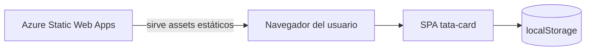

# Architecture

## Resumen

SPA Angular solo-cliente que gestiona el gasto semanal (“vale semanal”) en el navegador. Una página lazy-loaded concentra UI, cálculos, persistencia e interacciones. El hosting sirve el bundle estático; no hay servidor de aplicación.

## Contexto del sistema

- **Usuarios:** interactúan solo con la SPA.
- **Este sistema:** app Angular compilada a `dist/tata-card/browser`.
- **Externos:** Azure Static Web Apps para hosting/CI. No hay APIs de negocio de terceros en el código.

## Componentes principales

| Componente      | Responsabilidad                                          | Ubicación                                       |
| --------------- | -------------------------------------------------------- | ----------------------------------------------- |
| Bootstrap       | Arranca la app standalone con router + zone              | `src/main.ts`, `src/app/app.config.ts`          |
| Shell de app    | Hostea `router-outlet`                                   | `src/app/app.component.*`                       |
| Rutas           | Redirect `/` → `home-page`; lazy-load del feature        | `src/app/app.routes.ts`                         |
| Home page       | Presupuesto, ítems, totales, diálogos, DnD, persistencia | `src/app/home-page/`                            |
| Config estática | Fallback SPA a `index.html`                              | `public/staticwebapp.config.json`               |
| CI/CD           | Build + upload a Azure SWA en `master` / PRs             | `.github/workflows/azure-static-web-apps-*.yml` |

## Responsabilidades de componentes

| Componente          | Responsabilidad                                                                                                                                                                                                 | Ubicación                                  |
| ------------------- | --------------------------------------------------------------------------------------------------------------------------------------------------------------------------------------------------------------- | ------------------------------------------ |
| `HomePageComponent` | Signal de presupuesto, CRUD de filas, formato de moneda, alerta de sobrecupo, limpiar todo, confirmar borrado, reorder por drag, mover al final tras precio &gt; 0, aviso `beforeunload`, sync con localStorage | `src/app/home-page/home-page.component.ts` |
| Template            | Estructura semántica: `section`, `table`, `dialog`, `output` para subtotales                                                                                                                                    | `home-page.component.html`                 |
| Estilos             | Tabla en grid responsive (teléfono vs tablet+), diálogo, resumen de presupuesto                                                                                                                                 | `home-page.component.scss`                 |

## Comunicación

- Solo in-process: signals / computed / effects en `HomePageComponent`.
- Sin uso de HTTP client en el código de la app (`Inferido del código`).
- Router: `loadComponent` lazy para home.

## Flujo de datos

1. El usuario edita `weeklyBudget` o campos de fila → actualizan signals.
2. Se recalculan `totalUsed` / `available` / `isOverBudget`.
3. Un `effect` persiste `{ weeklyBudget, lines }` en `localStorage`.
4. En el constructor, se restaura desde `localStorage` si es válido.
5. Precio &gt; 0 agenda mover esa fila al final tras 4 s sin más cambios de precio.
6. Borrar / limpiar abre `<dialog>` con `showModal()`; confirmar muta `lines`.

## Persistencia de datos

| Almacén        | Clave / path                | Contenido                                                                      |
| -------------- | --------------------------- | ------------------------------------------------------------------------------ |
| `localStorage` | `tata-card:vale-semanal:v1` | JSON: `weeklyBudget` (number), `lines` (`id`, `item`, `quantity`, `unitPrice`) |

- Presupuesto por defecto en vacío: **1755**.
- Sin sync de servidor; alcance por origen y navegador.
- Fallos de modo privado / cuota se ignoran en los helpers de persistencia.

## Integraciones externas

- **Azure Static Web Apps** — deploy de estáticos precompilados (`skip_app_build: true`, `app_location: dist/tata-card/browser`).
- **GitHub Actions** — Node 22, `npm ci`, `npm run build`, luego upload a SWA.

## Seguridad (arquitectónica)

- Sin capa de autenticación en la app (`Inferido del código`).
- Los datos quedan en el dispositivo del usuario; quien tenga acceso al storage de ese origen puede leerlos/editarlos.
- El token de deploy vive en secretos de GitHub Actions, no en el repo.

## Despliegue

- Build: `ng build` → `dist/tata-card` (salida browser usada por SWA).
- Hosting: Azure Static Web Apps con `navigationFallback.rewrite: /index.html`.
- Triggers: push/PR a `master`; PR cerrado ejecuta acción “close” de SWA.
- **Producción:** [https://delightful-river-06fbd671e.7.azurestaticapps.net/home-page](https://delightful-river-06fbd671e.7.azurestaticapps.net/home-page) (confirmada por el usuario).

## Restricciones arquitectónicas

- Workspace Angular de una sola app (aunque `angular.json` declare `newProjectRoot: "projects"`, no hay apps bajo `projects/`).
- Feature concentrada en un componente standalone OnPush.
- Layout de tabla con CSS grid en `tr` por compatibilidad con CDK drag.
- Stack UI: FormsModule + CDK DragDrop + SCSS; no Angular Material.

## Desconocido / Requiere confirmación

- Dominio custom adicional más allá de la URL de Azure SWA (`Desconocido`).
- Si se planean más páginas/features (`Desconocido`).
